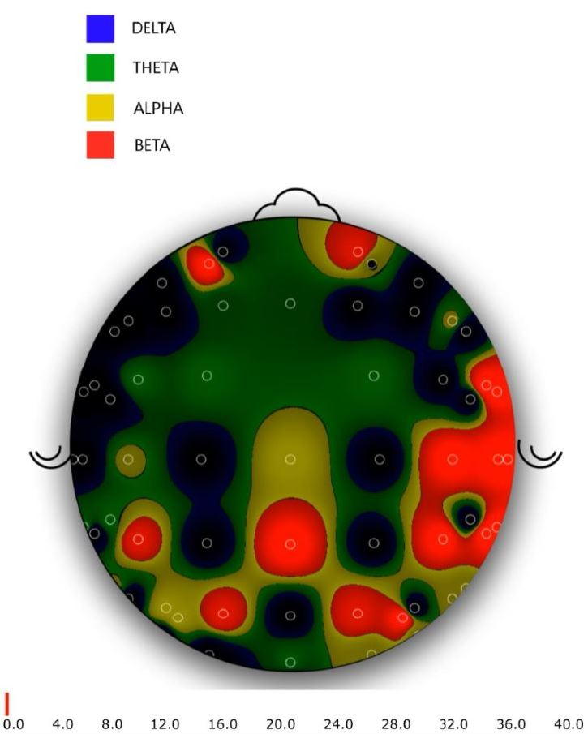

# Neurodynamics of the brain revealed by EEG recurrence analysis.

### W. Duch, K. Tołpa, S. Duda, Ł. Furman, M. Lewandowska. J. Dreszer.
### Neurcognitive Laboratory, Center for Modern Interdisciplinary Technologies, Nicolaus Copernicus University,

## (WIP)

### Recurrence Plot (GLSL based)

### Recurrence Plot (GLSL based)

### Topographical EEG map (GLSL based)

### Topographical Brain EEG map (GLSL based)

